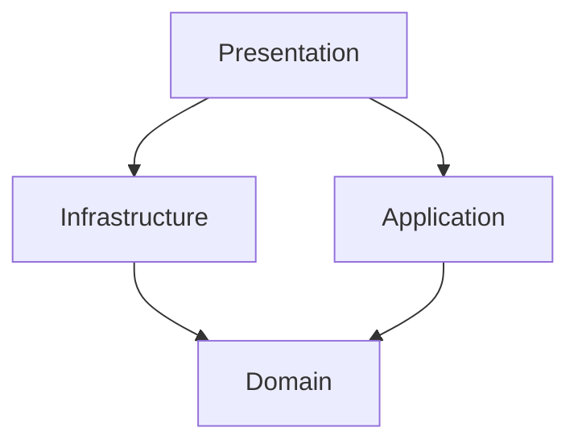

# GitMemo
A note tool that runs on Node.js and uses git as a database.

## Sub-commands
### Init

```sh
npx gitmemo init
```
GitMemo を利用するための初期化サブコマンド

## Architecture
アーキテクチャはオニオンアーキテクチャの思想をベースにしている。

以下に各レイヤーの依存関係と責務を記載する。



| レイヤー | 責務 |
| --- | --- |
| UI(Presentation) | クライアントとの接点を持つレイヤー。クライアントからのコマンドを解釈し、何らかの方法で何らかの対象からデータを取得してクライアントに提供する責務を負う。<br />基本的には Application 層の関数に Infrastructure 層の関数を注入して利用することを想定している。直接 Domain 層を参照することはない。 |
| Infrastructure | 上位のレイヤを支える一般的な技術的機能を提供する。これには、アプリケーションのためのメッセージ送信、ドメインのための永続化、ユーザインタフェースのためのウィジェット描画などがある。 |
| Application | アプリケーション固有のロジックを実装するレイヤー。Domain 層のインターフェースやロジックを組み合わせてユースケースを実現する。Application 層は特定のクライアントや永続化の技術には依存しない。 |
| Domain | ビジネスの概念と、ビジネスが置かれた状況に関する情報、およびビジネスルールを表す責務を負う。ビジネスの状況を反映する状態はここで制御され使用されるが、それを格納するという技術的な詳細は、Infrastructure 層に委譲される。この層がビジネスソフトウェアの核心である。 |

## Memo

Web preview 用のアプリケーションは Vite + Vue.js

メモを作成・保存などの主要ロジックは TypeScript で記述し、express でサーブする
