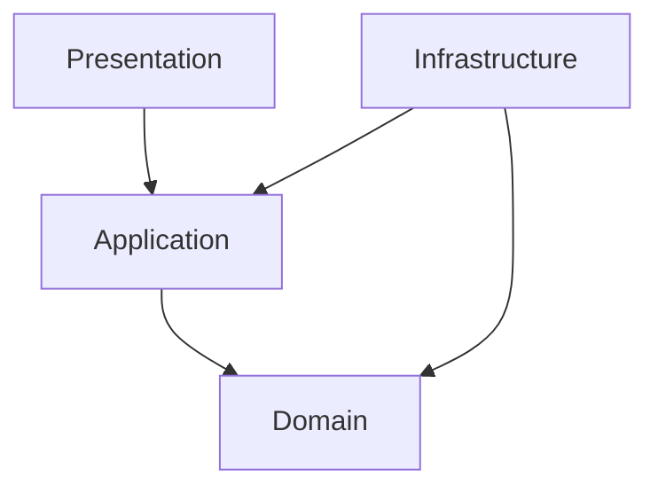

# GitMemo
A note tool that runs on Node.js and uses git as a database.

## Architecture

アーキテクチャはオニオンアーキテクチャっぽいものを採用している。

以下に各レイヤーの依存関係を示す。

```mermaid
flowchart TD
    Presentation --> Application
    Infrastructure --> Application
    Infrastructure --> Domain
    Application --> Domain
```

レイヤーの詳細な役割は各レイヤーの README.md に記載している。
