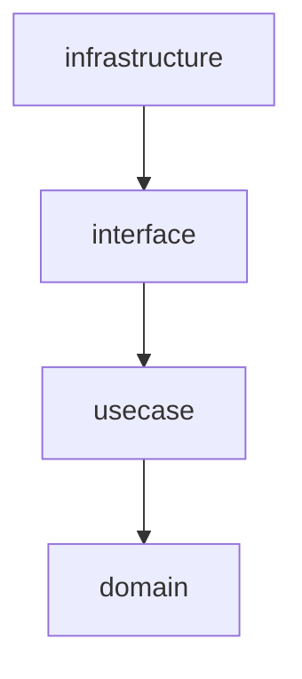

# GitMemo
A note tool that runs on Node.js and uses git as a database.

## Sub-commands
### Init

```sh
npx gitmemo init
```
GitMemo を利用するための初期化サブコマンド

## Architecture
アーキテクチャはクリーンアーキテクチャの思想をベースにしている。

| レイヤー | パッケージ名 | 役割 |
| -------- | -------- | -------- |
| Entities | domain | アプリケーションに関わらず存在するドメインオブジェクトとルールを置く |
| Use cases | usecase | アプリケーション固有のビジネスルール（このシステムが何をするか）を表現する |
| Interface Adapters | interface | 上位レイヤーが期待する形式にデータを変換するアダプター層。また、永続化や表示などシステム外部とやりとりをするロジックを定義する |
| Frameworks & Drivers | infrastructure | DB や FW 等システムの外部とされるものを繋ぐレイヤーで、薄くなることが好ましい |



## Memo
Web preview 用のアプリケーションは Vite + Vue.js

メモを作成・保存などの主要ロジックは TypeScript で記述し、express でサーブする
