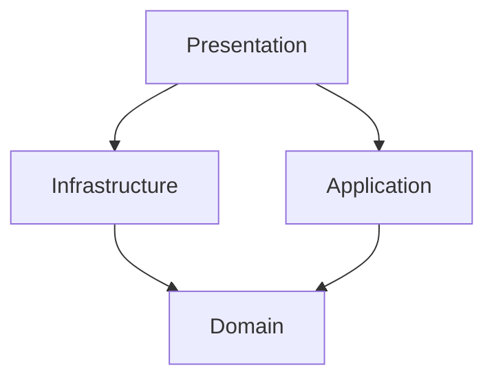
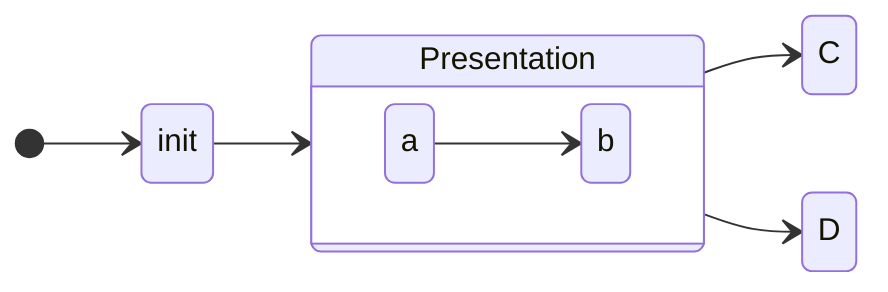

# GitMemo
A note tool that runs on Node.js and uses git as a database.

## Architecture

アーキテクチャはレイヤードアーキテクチャっぽいものを採用している。

以下に各レイヤーの依存関係を示す。



| レイヤー | 責務 |
| --- | --- |
| UI(Presentation) | ユーザに情報を表示して、ユーザのコマンドを解釈する責務を負う。外部アクタは人間のユーザではなく、別のコンピュータシステムのこともある。 |
|　Application　| ソフトウェアが行うことになっている仕事を定義し、表現力豊かなドメインオブジェクトが問題を解決するように導く。(中略) ビジネスルールや知識を含まず、やるべき作業を調整するだけで、実際の処理は、ドメインオブジェクトによって直下のレイヤで実行される共同作業に委譲する。 (後略) |
| Domain | ビジネスの概念と、ビジネスが置かれた状況に関する情報、およびビジネスルールを表す責務を負う。ビジネスの状況を反映する状態はここで制御され使用されるが、それを格納するという技術的な詳細は、インフラストラクチャに委譲される。この層がビジネスソフトウェアの核心である。 |
| Infrastructure | 上位のレイヤを支える一般的な技術的機能を提供する。これには、アプリケーションのためのメッセージ送信、ドメインのための永続化、ユーザインタフェースのためのウィジェット描画などがある。インフラストラクチャ層は、ここで示す4層間における相互作用のパターンも、アーキテクチャフレームワークを通じてサポートすることがある。 |

## Commands
### Init
GitMemo を利用するための初期化サブコマンド



```sh
.
├── client
│   ├── components
│   └── pages
└── server
    ├── help.ts
    ├── index.ts
    ├── init.ts
    ├── list.ts
    ├── new.ts
    ├── preview.ts
    ├── save.ts
    └── utils
```

レイヤーの詳細な役割は各レイヤーの README.md に記載している。
