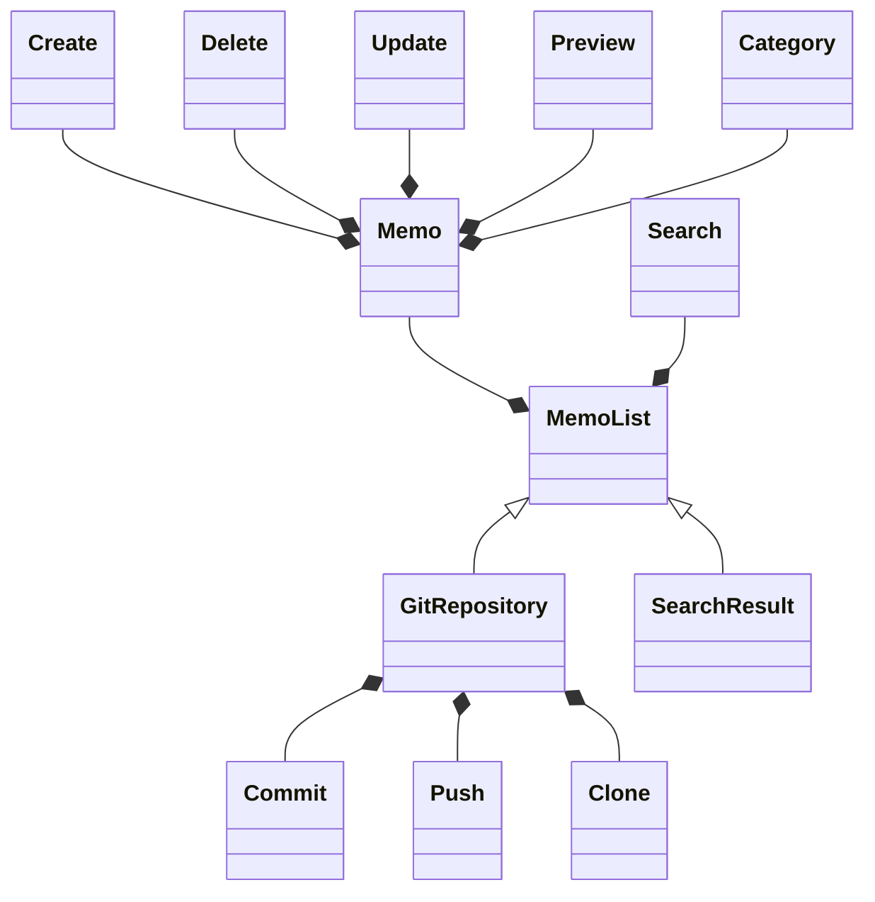

## ドメインモデリング

### 要求

1. ユーザーは任意の git リポジトリをデータベースとして利用することができる
   1. ユーザーの PC のホームディレクトリに git clone される
2. 新しくメモを作成することができる
3. 作成したメモを削除することができる
4. 様々な検索方法（タイトル, カテゴリー, キーワードなど）でメモを検索することができる
5. メモはカテゴリー毎に作成した順で一覧化されいてる
   1. 様々な規則（作成順, 更新順など）で並び替えることができる
6. メモはマークダウン・uml に対応している
7. メモは任意のエディタで編集でき、web ブラウザでプレビューすることができる
   1. メモを更新するとブラウザでも更新される
8. メモの編集差分を git commit することができる
9. メモの編集差分を git push することができる
10. プレビューなどのコマンドは任意の CLI から実行することができる
    1.  ユーザーはどのディレクトリからでもメモをプレビューすることができる

### 名刺・名詞句

このアプリケーションは git を利用することが前提なので、git の知識も持っている。

- メモ => `Memo`
- カテゴリー => `Category`
- 検索結果 => `SearchResult`
- ユーザー => `User`
- Gitリポジトリ => `GitRepository`
- git commit => `Commit`
- git push => `Push`
- git clone => `Clone`
- 作成 => `Create`
- 作成 => `Delete`
- 編集 => `Update`
- プレビュー => `Preview`
- 検索方法 => `Search`

